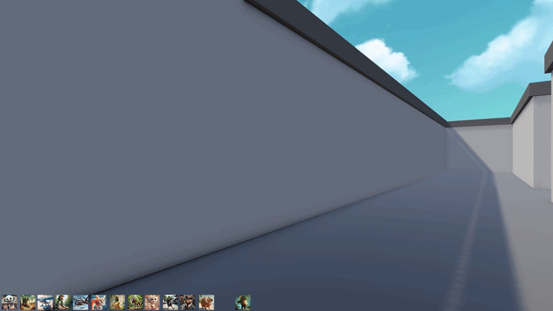
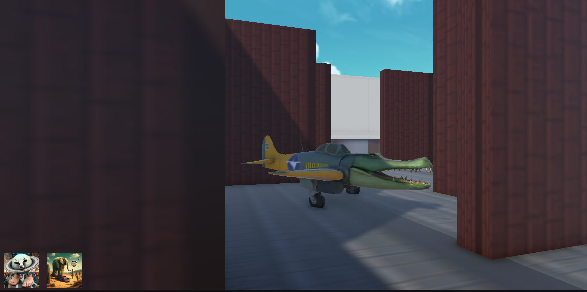
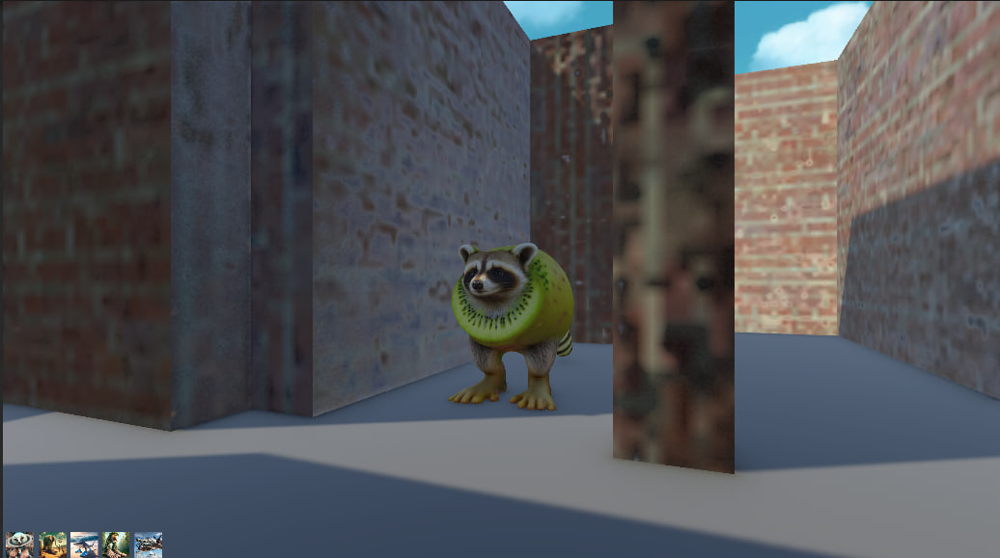
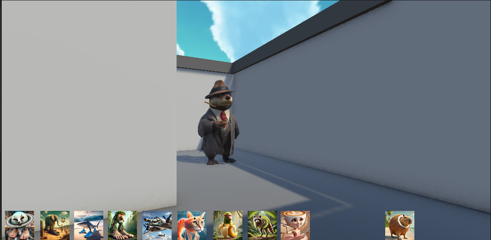
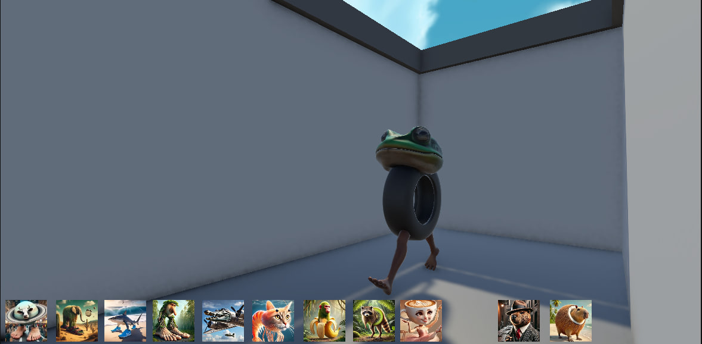
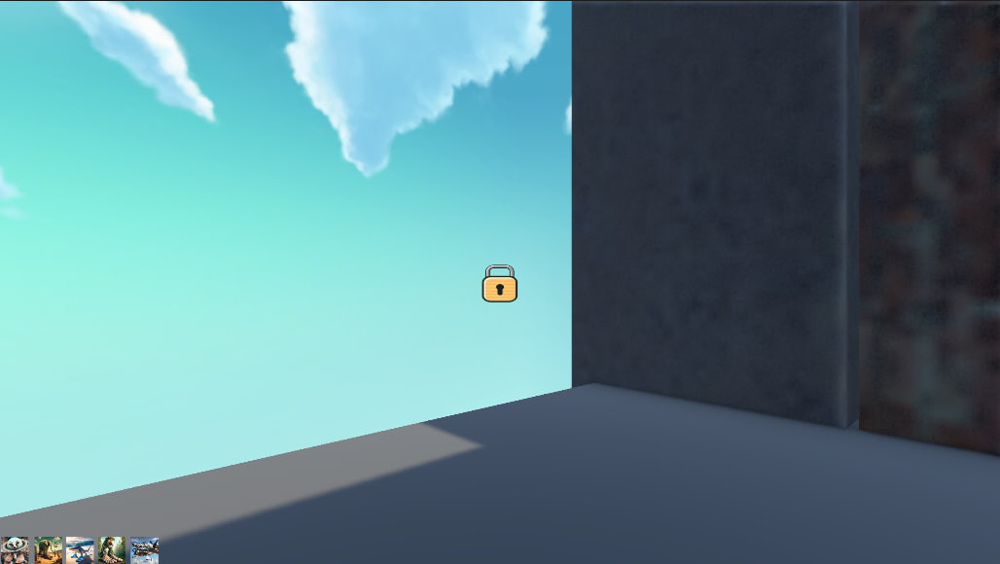
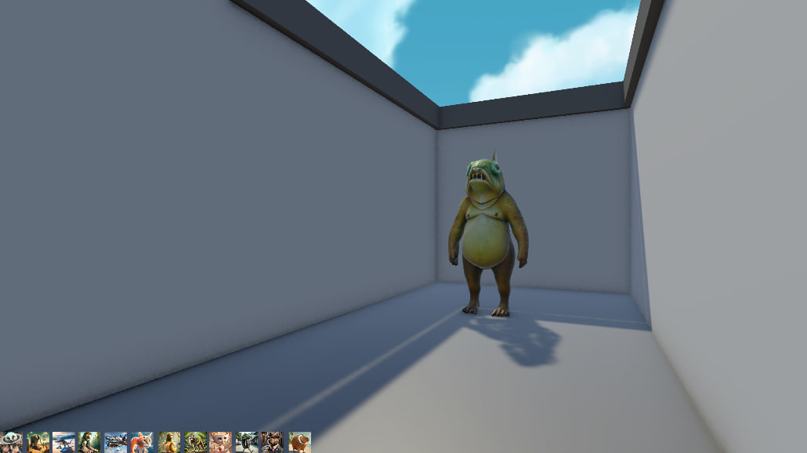

# Labyrinth NeuroAnimals

First-person maze game made in Unity.

The player explores a series of labyrinth levels, searching not only for the exit, but also for hidden NeuroAnimals scattered throughout the maze.

To complete a level and unlock the next one, the player must:
- find the exit;
- collect all NeuroAnimals hidden in the labyrinth.

When a NeuroAnimal is found, its collectible card appears on the screen.

---

## Gameplay Preview




---

## Screenshots

<p align="center">
  
  
</p>
<p align="center">
  
  
</p>
<p align="center">
  
  
</p>

---

## Gameplay Features

- First-person exploration
- Multiple maze levels
- Hidden collectible NeuroAnimals
- Card collection system
- Level progression
- Atmospheric labyrinth gameplay

## Screenshots

_Add screenshots here_

## Controls

- **WASD** — Move
- **Mouse** — Look around
- **Space** — Jump

## Built With

- Unity
- C#

## Project Structure

```text
Assets/
Packages/
ProjectSettings/
